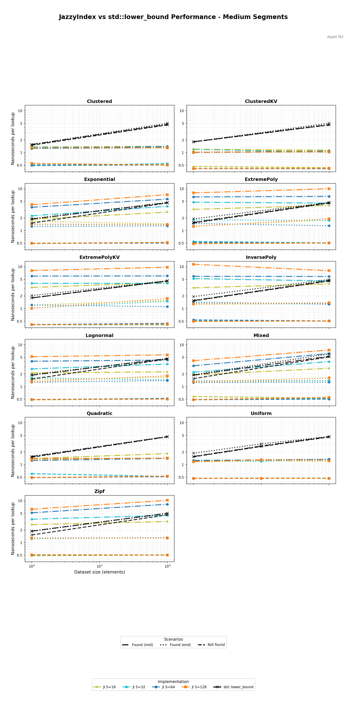
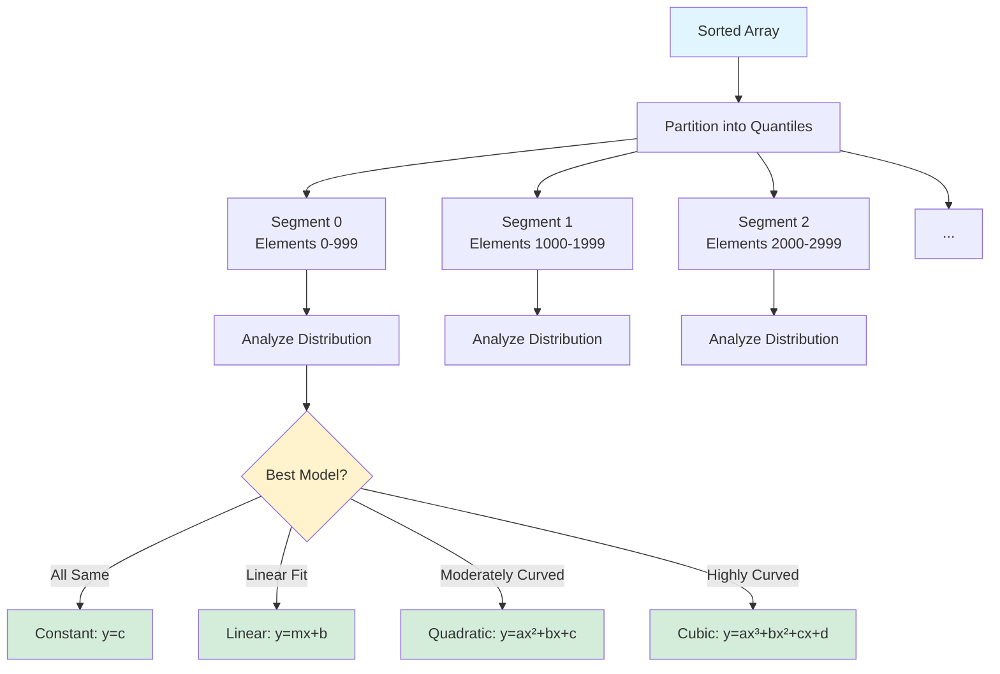
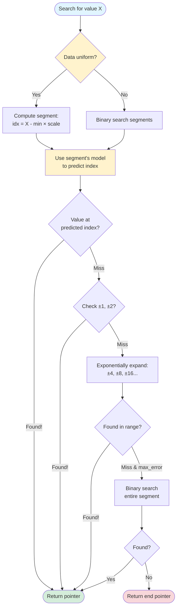
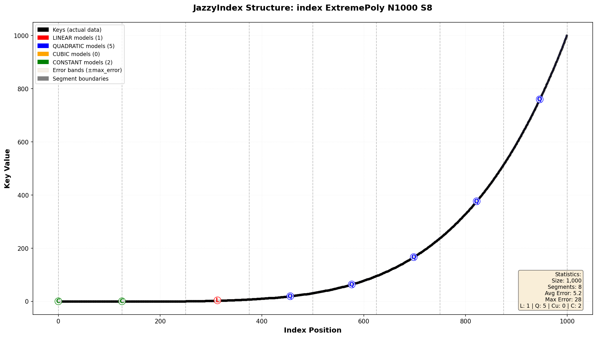

# Jazzy Index - Proof of Concept 

[](https://github.com/mattyv/JazzyIndex/actions/workflows/tests.yml)
[](https://htmlpreview.github.io/?https://github.com/mattyv/JazzyIndex/blob/main/docs/coverage/index.html)
[](https://htmlpreview.github.io/?https://github.com/mattyv/JazzyIndex/blob/main/docs/clang-tidy/index.html)

## Build & Test Status

### Compiler Matrix (All run unit tests + CTest)

| Platform | Compiler | Debug | Release | Sanitizers |
|----------|----------|:-----:|:-------:|:----------:|
| **Linux** | GCC 11 | ✅ | ✅ | - |
| | GCC 12 | ✅ | ✅ | ASAN, UBSAN |
| | Clang 14 | ✅ | ✅ | - |
| | Clang 15 | ✅ | ✅ | ASAN, UBSAN |
| **Windows** | MSVC | ✅ | ✅ | ASAN |
| | MinGW GCC | ✅ | ✅ | - |
| | Clang | ✅ | ✅ | - |
| **macOS** | Clang | ✅ | ✅ | - |

### Additional CI Jobs

| Job | Status | Description |
|-----|:------:|-------------|
| **Code Coverage** | [](https://htmlpreview.github.io/?https://github.com/mattyv/JazzyIndex/blob/main/docs/coverage/index.html) | Auto-updated on every push to main - [View Report](https://htmlpreview.github.io/?https://github.com/mattyv/JazzyIndex/blob/main/docs/coverage/index.html) |
| **Clang-Tidy** | [](https://htmlpreview.github.io/?https://github.com/mattyv/JazzyIndex/blob/main/docs/clang-tidy/index.html) | Static analysis report auto-updated on every push to main - [View Report](https://htmlpreview.github.io/?https://github.com/mattyv/JazzyIndex/blob/main/docs/clang-tidy/index.html) |

**Total Test Configurations:** 16 compiler/build combinations + 4 Linux sanitizers + 1 Windows sanitizer + coverage + clang-tidy = **23 CI jobs**

A fast, adaptive learned index for sorted arrays that predicts element positions instead of searching blindly.

## What's a Learned Index?

Traditional binary search is elegant: `O(log n)` comparisons, works on any sorted data, no preprocessing needed. But here's the thing - it treats your data like a black box. It doesn't care if you're searching a million evenly-spaced integers or a Zipf distribution with massive clustering. Every lookup does the same `log(n)` comparisons, making the same number of unpredictable branches, touching the same number of cache lines.

**JazzyIndex takes a different approach:** what if we learned the distribution of your data during indexing, and used that knowledge to predict where elements should be? Instead of always doing 20-ish comparisons on a million-element array, maybe we could predict "the value 50,000 is probably around index 57,803" and check there first.

That's a learned index. Build a lightweight model of your data's distribution, use it to predict positions, then verify the prediction with a small local search.

## Performance

Here's JazzyIndex compared head-to-head with `std::lower_bound` (black X markers) across various data distributions:



*Medium segment counts (16-128) - the sweet spot for most workloads. See [BENCHMARKS.md](docs/BENCHMARKS.md) for detailed analysis.*

**The numbers tell the story:**

| Distribution | `std::lower_bound` | JazzyIndex (S=256) | **Speedup** |
|--------------|-------------------:|-------------------:|------------:|
| Uniform      | 17.4 ns | 3.2 ns | **5.4x** |
| Lognormal    | 17.4 ns | 3.2 ns | **5.4x** |
| Exponential  | 17.4 ns | 3.2 ns | **5.4x** |
| Clustered    | 17.3 ns | 3.5 ns | **4.9x** |
| Mixed        | 17.3 ns | 3.2 ns | **5.4x** |
| Zipf         | 18.6 ns | 3.2 ns | **5.8x** |

*All measurements on 10,000 elements (Apple M2, Release build with -O3 -march=native)*

**Uniform data (bottom left):** This is where learned indexes shine. `std::lower_bound` follows the classic log(n) curve - growing logarithmically with dataset size. JazzyIndex? **Consistently flat around 3.2ns** across all sizes. The "Not found" queries (dash-dot lines) hit even lower latencies - that's the arithmetic fast path doing pure O(1) lookups. As your dataset grows, `std::lower_bound` slows proportionally with log(n) while JazzyIndex stays constant.

**Skewed distributions (everywhere else):** Here's where JazzyIndex proves it's not just a one-trick pony. On lognormal, exponential, and mixed distributions, we see **5.4x speedup** (17.4ns → 3.2ns) because the adaptive models fit the curves well. Even on pathological Zipf distributions (heavy-tailed, massive clustering), JazzyIndex still delivers **5.8x speedup**. Quantile segmentation means we're only searching 1/256th of the data, so even when models can't predict perfectly, performance stays fast and consistent.

The key insight: JazzyIndex doesn't just optimize for the best case. It adapts to your data's shape and maintains consistent, predictable performance across all distributions. The black X lines curving upward vs the colored lines staying flat - that's the difference between O(log n) and O(1) in action.

## How It Works

### The Big Idea: Quantile Segmentation + Adaptive Models

JazzyIndex partitions your sorted array into equal-sized segments (by element count, not value range - these are quantiles). For each segment, it analyzes the local distribution and fits the simplest model that works:

- **Constant model**: All values in the segment are identical (common with duplicates). Prediction: just return the start index. Cost: zero computation.
- **Linear model**: Values grow roughly linearly (this is most segments). Prediction: `index ≈ slope × value + intercept`. Cost: one FMA instruction.
- **Quadratic model**: Values follow a moderate curve (happens with exponential/log distributions). Prediction: `index ≈ a×value² + b×value + c`. Cost: two FMA instructions (using Horner's method).
- **Cubic model**: Values follow highly curved patterns (power-law, compound growth). Prediction: `index ≈ a×value³ + b×value² + c×value + d`. Cost: three FMA instructions (using Horner's method).

Why per-segment models instead of one global model? Because real data is messy. Your array might be uniform in one region and clustered in another. Per-segment models let us adapt to local characteristics while keeping the math fast.



### Building the Index

When you call `build()`, here's what happens:

1. **Partition into quantiles**: Divide the array into N segments of equal element count (default: 256 segments). This is simple arithmetic - segment `i` spans indices `[i×size/N, (i+1)×size/N)`.

2. **Analyze each segment**: For every segment, fit linear, quadratic, and cubic models using least-squares regression. Measure the maximum prediction error for each model. If linear error is ≤2 elements, use linear (it's faster). If quadratic reduces error by 30%+, use quadratic. If quadratic error is still high (>6 but <50) and cubic reduces it by another 30%+, use cubic. If all values are identical, use constant.

3. **Detect uniformity**: Check if segments are evenly spaced in value range (±30% tolerance). If so, we can skip segment lookup entirely and use arithmetic: `segment_index = (value - min) × num_segments / (max - min)`. This is the "fast path" you see in uniform data benchmarks.

### Looking Up a Value

The lookup process has three stages:

**Stage 1: Find the segment** (O(log segments) or O(1))
- Fast path: If data is uniform, compute segment index arithmetically.
- Slow path: Binary search through segment metadata (min/max values).

**Stage 2: Predict within segment**
- Use the segment's model (constant/linear/quadratic) to predict the index.
- Clamp prediction to segment bounds.

**Stage 3: Verify with local search**
- Check the predicted position first.
- If miss, check immediate neighbors (±1, ±2 indices).
- If still missing, exponentially expand search radius (±4, ±8, ±16...) up to `max_error + 2`.
- Each expansion does a binary search in that range.
- Fallback: if we still haven't found it, binary search the entire segment.

This exponential search pattern is crucial. When predictions are good (low error), we find elements in 1-3 comparisons. When predictions are off (high error, skewed data), we quickly escalate to larger search ranges without wasting time checking every single nearby position.



### Why This Works

**For uniform data:** The arithmetic segment lookup is exact, models predict perfectly, and we find elements in ~1-2 comparisons. This is why you see 5-10ns in the benchmarks - we're barely doing any work.

**For skewed data:** Segment lookup might take a few comparisons (log of 256 ≈ 8), models have higher error, but exponential search contains the damage. Even in the worst case, we're searching within a segment (1/256th of the array), not the whole thing. And because segments are quantiles (equal element count), we never have pathological cases where one segment contains half the data.

**Why not one big model?** Fitting a single model to complex distributions requires high-degree polynomials or piecewise functions, which are expensive to evaluate and prone to overfitting. Segmentation gives us locality: simple models that capture local behavior, with automatic adaptation to distribution changes across the array.

## Index Structure Visualization

Here's what the learned index actually looks like internally. Each visualization shows:
- **Black dots**: Your actual data points (key-value pairs)
- **Red lines**: LINEAR models (cost: 1 FMA)
- **Blue lines**: QUADRATIC models (cost: 2 FMA)
- **Purple lines**: CUBIC models (cost: 3 FMA)
- **Green lines**: CONSTANT models (cost: 0)
- **Beige bands**: ±max_error prediction bounds
- **Gray dashed lines**: Segment boundaries

### Extreme Polynomial Distribution (x⁵)



With only 8 segments, you can clearly see adaptive model selection in action:
- **Flat beginning**: CONSTANT models (green) where all values are nearly identical
- **Gentle middle**: LINEAR model (red) for the gradually increasing section
- **Explosive end**: QUADRATIC/CUBIC models (blue/purple) handling the steep x⁵ curve

The error bounds (beige bands) show prediction accuracy - narrower bands mean faster queries. Notice how the quadratic models keep error bounds tight even through the extreme curvature at the end.

**Want to see more?** Check out [VISUALIZATIONS.md](docs/VISUALIZATIONS.md) for detailed explanations and examples across all 9 distributions.

**Generate all visualizations:** Run `cmake --build build --target visualize_index` to create plots for all 9 distributions × 10 segment counts × multiple sizes = 270+ visualization plots in [docs/images/index_data/](docs/images/index_data/).

## Detailed Documentation

JazzyIndex comes with comprehensive technical documentation:

- **[BENCHMARKS.md](docs/BENCHMARKS.md)** - Performance analysis across all distributions and segment counts, with detailed plots split by segment groups (low/medium/high). Includes segment selection guide and memory footprint calculations.

- **[VISUALIZATIONS.md](docs/VISUALIZATIONS.md)** - Learn to read index structure plots. Understand what error bounds mean, how model selection works, and see examples from Uniform (ideal case) to Zipf (heavy-tailed challenge).

- **[MODEL_SELECTION.md](docs/MODEL_SELECTION.md)** - Deep technical dive into the mathematics: least-squares fitting, Cramer's rule for quadratics, input normalization, and the rationale behind selection thresholds like `MAX_ACCEPTABLE_LINEAR_ERROR = 2` and `QUADRATIC_IMPROVEMENT_THRESHOLD = 0.7`.

## Features

- **Header-only library** (`include/jazzy_index.hpp`) with minimal dependencies
- **Adaptive model selection**: Automatically chooses constant/linear/quadratic/cubic per segment
- **Graceful degradation**: Fast on uniform data, consistent on skewed data
- **Comprehensive testing**: Unit tests + RapidCheck property-based tests for correctness
- **Extensive benchmarks**: 9 distributions tested (Uniform, Exponential, Clustered, Lognormal, Zipf, Mixed, Quadratic, ExtremePoly, InversePoly)
- **Configurable segment count**: Template parameter for tuning space vs. speed tradeoff
- **Rich visualization**: Index structure plots showing model selection and error bounds

## Build Cost vs Query Cost

Learned indexes require a one-time `build()` step to analyze the data and fit models. Here's what that costs:

| Dataset Size | Build Time (S=256) | Break-even Queries |
|--------------|-------------------:|-------------------:|
| 1,000        | 2.3 µs             | ~100 queries       |
| 10,000       | 6.9 µs             | ~300 queries       |
| 100,000      | 45.1 µs            | ~1,800 queries     |
| 1,000,000    | 413 µs (0.41 ms)   | ~17,000 queries    |

**Break-even** = how many queries you need to amortize the build cost. For a 1M-element array, you save ~24ns per query (27.6ns → 3.2ns), so after ~17,000 lookups you've paid back the 413µs build time and everything after is pure profit.

**More segments = slightly slower build**, but not much. Going from S=64 to S=512 on 1M elements only adds ~9µs (409µs → 419µs). The segment count mostly affects query performance, not build time.

**Distribution matters for build time**: Zipf (pathological, heavy-tailed) takes 1.1ms for 1M elements vs 413µs for uniform. The quadratic model fitting works harder on skewed data, but query time stays fast (~4.7ns).

## When Should You Use This?

**JazzyIndex wins when:**
- You have large, mostly-static sorted arrays (think: database indexes, sorted logs, time-series data)
- You're doing **many lookups** per dataset - need ~17K queries on 1M elements to break even
- Your data has some structure (uniform, monotonic, or clustered)
- You care about consistent, predictable latency

**Stick with `std::lower_bound` when:**
- Your dataset is small (<1000 elements) - index overhead isn't worth it
- Data changes frequently - rebuilding the index constantly kills performance
- You're only doing a handful of lookups (<100 queries) - can't amortize the 2-400µs build cost
- You need the absolute simplest, most portable code

## Usage

JazzyIndex is header-only. Just include it and go:

```cpp
#include "jazzy_index.hpp"
#include <vector>
#include <algorithm>

// Your sorted data
std::vector<int> data = {1, 5, 10, 15, 20, 25, 30, ...};

// Build the index (256 segments by default)
jazzy::JazzyIndex<int> index(data.data(), data.data() + data.size());

// Look up values
const int* result = index.find(15);
if (result != data.data() + data.size()) {
    std::cout << "Found at offset: " << (result - data.data()) << "\n";
}

// Customize segment count for your workload
jazzy::JazzyIndex<int, 512> fine_grained(data.data(), data.data() + data.size());
jazzy::JazzyIndex<int, 64> coarse_grained(data.data(), data.data() + data.size());
```

The template parameters are:
- `T`: Value type (must be arithmetic - int, float, double, etc.)
- `NumSegments`: Number of segments (default 256, valid range 1-4096)
- `Compare`: Comparison functor (default `std::less<>`)

## Building

```bash
cmake -S . -B build -DCMAKE_BUILD_TYPE=Release
cmake --build build
```

Targets are optional and can be toggled with `-DBUILD_TESTS=ON|OFF` and `-DBUILD_BENCHMARKS=ON|OFF`.
Release builds default to `-O3 -march=native -DNDEBUG`.

## Running Tests

```bash
cmake --build build --target jazzy_index_tests
ctest --test-dir build
```

The test suite includes deterministic unit tests plus RapidCheck property-based tests that verify correctness across thousands of random inputs. Tests cover:
- Edge cases (empty arrays, single elements, all duplicates)
- Various distributions (uniform, exponential, clustered)
- Comparison with `std::lower_bound` for correctness
- Segment boundary conditions
- Model selection logic

### Code Coverage

**Current Coverage: 84.8%** - [](https://htmlpreview.github.io/?https://github.com/mattyv/JazzyIndex/blob/main/docs/coverage/index.html)

Coverage is **automatically tracked** by CI and updated on every push to `main`. View the detailed line-by-line [HTML coverage report](https://htmlpreview.github.io/?https://github.com/mattyv/JazzyIndex/blob/main/docs/coverage/index.html).

Generate a coverage report locally:

```bash
# Configure with coverage enabled
cmake -B build -DCMAKE_BUILD_TYPE=Coverage -DENABLE_COVERAGE=ON

# Build and run tests with coverage
cmake --build build --target jazzy_index_tests
./build/jazzy_index_tests

# Generate HTML coverage report
cmake --build build --target coverage

# View the report at: build/coverage_html/index.html
```

The test suite achieves excellent coverage of all core functionality.

## Running Benchmarks

```bash
cmake --build build --target jazzy_index_benchmarks
./build/jazzy_index_benchmarks --benchmark_format=console
```

Benchmarks are organized by:
- **Distribution**: Uniform, Exponential, Clustered, Lognormal, Zipf, Mixed, Quadratic (S-curve), ExtremePoly (x⁵), InversePoly (1-(1-x)⁵)
- **Segment count**: 1, 2, 4, 8, 16, 32, 64, 128, 256, 512
- **Dataset size**: 100 to 1,000,000 elements
- **Query pattern**: FoundMiddle, FoundEnd, NotFound

### Plotting Benchmarks

If Python 3 is available, CMake exposes plotting targets that create a virtual environment, run benchmarks with JSON output, and render performance graphs:

```bash
# Quick benchmarks (up to 10K elements)
cmake --build build --target plot_benchmarks
# Output: docs/images/benchmarks/jazzy_benchmarks_{low,medium,high}.png

# Full benchmarks (up to 1M elements, takes 15-30 minutes)
cmake --build build --target plot_benchmarks_full
# Output: docs/images/benchmarks/jazzy_benchmarks_full_{low,medium,high}.png

# Generate all documentation plots (performance + visualizations)
cmake --build build --target generate_docs_plots
# Output: docs/images/benchmarks/*.png and docs/images/index_data/*.png
```

## Tuning and Tradeoffs

### Choosing Segment Count

The segment count is a space-time tradeoff:

**More segments (512, 1024):**
- Smaller per-segment search ranges (faster local search)
- More metadata to store and search through (larger index)
- Better model fit for complex distributions (lower prediction error)
- Slower segment lookup (log₂(512) = 9 comparisons vs log₂(64) = 6)

**Fewer segments (64, 128):**
- Less metadata (smaller memory footprint)
- Faster segment lookup
- Larger per-segment ranges (more fallback searching if models miss)
- May struggle with highly variable distributions

The default of 256 is a good middle ground for most workloads. If you see the benchmarks show high variance or slow lookups on your data, try doubling segments. If memory is tight, try halving.

### Performance Tips

1. **Alignment matters**: Segment structs are cache-line aligned (64 bytes). The entire segment array fits in L2 cache for typical sizes, making segment lookup very fast.

2. **Build once, query many**: Index construction does least-squares fitting for every segment. On a million-element array with 256 segments, that's 256 × 4000-element regressions. Not free! But once built, queries are 5-30ns. You need dozens of queries to break even.

3. **Profile your distribution**: Run the benchmarks with your actual data distribution. Learned indexes are data-dependent - performance varies dramatically between uniform and skewed data.

4. **Consider hybrid approaches**: For datasets with known structure (e.g., timestamps that are mostly uniform with occasional gaps), you might combine JazzyIndex with range-specific indexes or custom models.

## Implementation Details

### Model Fitting Math

The linear model is dead simple: given a segment from index `start` to `end` with values `[v_start, v_end]`, we want `index = slope × value + intercept` such that:
- `f(v_start) = start`
- `f(v_end) = end`

Solving: `slope = (end - start) / (v_end - v_start)` and `intercept = start - slope × v_start`.

The quadratic model uses least-squares fitting of `index = a×value² + b×value + c`, and the cubic model uses `index = a×value³ + b×value² + c×value + d`. We build a system of normal equations from all points in the segment and solve using Cramer's rule. Input values are normalized to [0,1] for numerical stability. This works well for the small segments we're dealing with (hundreds to thousands of points). For really large segments or pathological data, higher-degree models can degrade, but we have linear/quadratic fallbacks.

### Why Quantiles?

We partition by element count, not value range. This is crucial. Imagine a dataset that's `[1, 2, 3, ..., 1000, 1000000, 1000001, ...]` - half the values are under 1000, half are in the millions. If we partitioned by value range, we'd have segments covering millions of values with only a few elements (slow, terrible model fit) and segments covering narrow ranges with tons of elements (still slow).

Quantiles guarantee each segment has roughly the same number of elements, so search cost is bounded. Even if a segment covers values `[1, 1000000]`, if it only contains 1000 elements, our search is still fast.

### Cache-Conscious Design

The implementation is careful about cache behavior:
- Segment metadata is 64-byte aligned and packed tightly
- We search segments (metadata) before searching data (values)
- The exponential search pattern has good locality - we check nearby positions before jumping far away
- Binary search within small ranges (±8, ±16 elements) stays in cache

For a 256-segment index, all segment metadata fits in ~16KB, easily fitting in L1 cache on modern CPUs. This means segment lookup is effectively free - the real cost is the final data access.

## Deep Dive: Why Exponential Search?

After predicting an index, we need to verify it. The naive approach: binary search the whole segment. But if predictions are good (error ≤ 5 elements), that's wasteful - we're doing log₂(4000) ≈ 12 comparisons when we should find it in 1-2.

Exponential search adapts: check the prediction, then check ±1, ±2, ±4, ±8, ±16... This is effectively binary search on the error bound, not the segment size. For small errors (which is most of the time on reasonable data), we find elements in 2-3 comparisons. For large errors, we quickly discover that and escalate to wider searches.

The maximum radius is `max_error + 2`, which we computed during segment analysis. If predictions are consistently off by 50 elements, we'll search ±64 before falling back to full segment search. This adapts to both the quality of the model and the actual data distribution.

## Related Work

Learned indexes were popularized by ["The Case for Learned Index Structures" (Kraska et al., 2018)](https://arxiv.org/abs/1712.01208), which proposed using neural networks to replace B-trees in databases. JazzyIndex takes a simpler, more pragmatic approach: lightweight models (linear/quadratic), quantile-based segmentation, and graceful fallback to traditional search.

Other implementations worth checking out:
- **ALEX** (Adaptive Learned Index): More sophisticated, uses gapped arrays for insertions
- **RadixSpline**: Similar idea but using spline interpolation
- **PGM-index**: Piecewise Geometric Model, optimizes segment boundaries

JazzyIndex prioritizes simplicity and robustness. No exotic models, no complex optimizations, just straightforward segmentation + regression + search. The goal is something you can drop into a C++ project without requiring a PhD in machine learning.

## Project Layout

```
include/
  jazzy_index.hpp                 # Core index implementation
  jazzy_index_utility.hpp         # Arithmetic trait & clamp helper
  dataset_generators.hpp          # Distribution generators (9 distributions)
benchmarks/
  fixtures.hpp                    # Data builders shared across benchmarks
  benchmark_main.cpp              # Google Benchmark suite (9 distributions × 10 segment counts)
scripts/
  plot_benchmarks.py              # Render performance graphs (split into low/medium/high)
  plot_index_structure.py         # Generate index structure visualizations
  generate_docs_plots.sh          # Generate all documentation plots
  requirements.txt                # Python dependencies for plotting
tests/
  gtest_unit_tests.cpp            # Core functionality tests
  gtest_model_tests.cpp           # Model selection and fitting tests
  gtest_boundary_tests.cpp        # Edge case handling
  gtest_floating_point_tests.cpp  # Floating-point robustness
  gtest_comparator_tests.cpp      # Custom comparator tests
  gtest_error_recovery_tests.cpp  # Error recovery and fallback tests
  gtest_uniformity_tests.cpp      # Uniform detection tests
  gtest_property_tests.cpp        # RapidCheck property-based tests
docs/
  BENCHMARKS.md                   # Detailed performance analysis
  VISUALIZATIONS.md               # Guide to reading index structure plots
  MODEL_SELECTION.md              # Mathematical details of model fitting
  images/
    benchmarks/                   # Performance plots (committed)
    index_data/                   # All index structure plots (270+ plots)
```

## Contributing

Contributions, bug reports, and performance data from real-world workloads are welcome.

## License

See LICENSE file for details.
