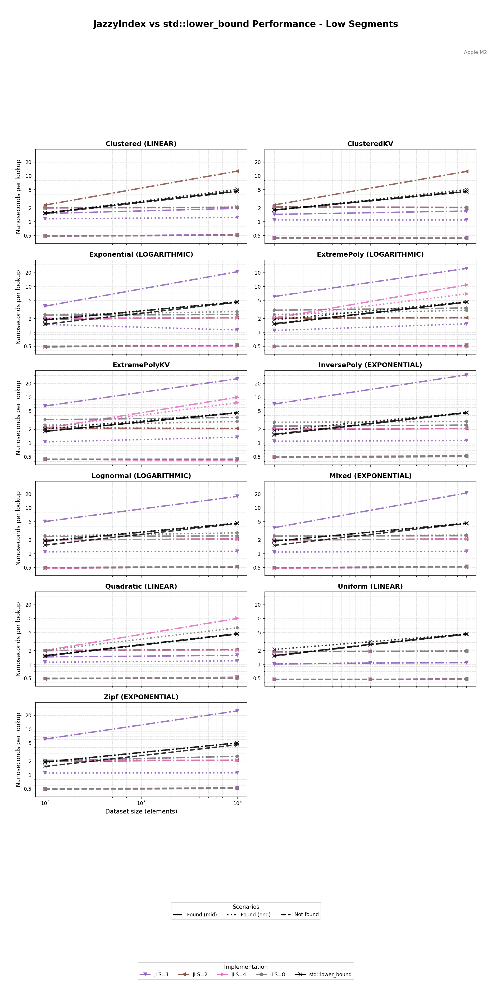
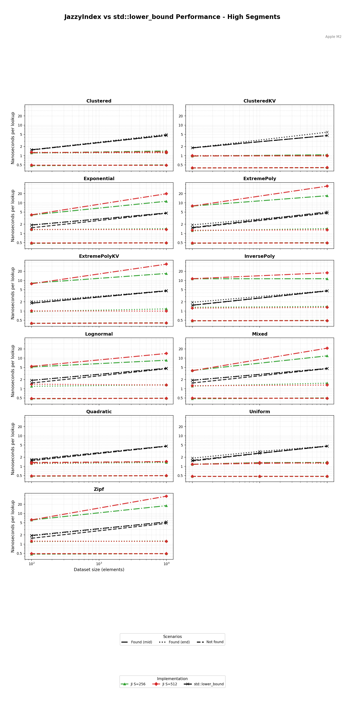

# JazzyIndex Performance Benchmarks

Comprehensive performance analysis of JazzyIndex vs. `std::lower_bound` across multiple data distributions and segment configurations.

## Table of Contents
- [Overview](#overview)
- [Benchmark Setup](#benchmark-setup)
- [Performance by Segment Group](#performance-by-segment-group)
- [Distribution Analysis](#distribution-analysis)
- [Segment Count Selection Guide](#segment-count-selection-guide)
- [Running Benchmarks](#running-benchmarks)

## Overview

JazzyIndex is benchmarked against `std::lower_bound` (binary search) across 9 different data distributions to evaluate:
- **Query performance:** Nanoseconds per lookup
- **Segment count impact:** How 1-512 segments affect performance
- **Distribution sensitivity:** Which data patterns benefit most
- **Query scenarios:** Found (middle/end) vs. Not Found cases

All benchmarks use Google Benchmark on sorted `uint64_t` arrays with datasets from 100 to 10,000 elements.

## Benchmark Setup

### Test Distributions

1. **Uniform** - Evenly spaced values (ideal case)
2. **Exponential** - Exponential decay distribution
3. **Clustered** - 5 Gaussian clusters
4. **Lognormal** - Log-normal distribution (realistic workload)
5. **Zipf** - Power-law distribution (web traffic, word frequencies)
6. **Mixed** - 50% exponential + 50% clustered
7. **Quadratic** - S-curve using tanh (smooth sigmoid)
8. **ExtremePoly** - x⁵ polynomial (explosive end curvature)
9. **InversePoly** - 1-(1-x)⁵ (steep start curvature)

### Query Scenarios

Each distribution is tested with 3 query patterns:
- **FoundMiddle (`--` dashed):** Search for value at middle position
- **FoundEnd (`:` dotted):** Search for value at end position
- **NotFound (`-.` dash-dot):** Search for value not in dataset

### Segment Counts Tested

10 configurations: **1, 2, 4, 8, 16, 32, 64, 128, 256, 512**

For clarity, performance plots are split into three groups:

## Performance by Segment Group

### Low Segment Counts (1, 2, 4, 8)



**Characteristics:**
- Fewer segments = less memory overhead
- Larger error bounds per segment
- More queries fall back to exponential search
- **Best for:** Very small datasets (< 1K elements) or memory-constrained systems

**Key Observations:**
- Segment count 1 (purple) is essentially linear scan - only useful for tiny datasets
- Segments 4-8 show reasonable performance for simple distributions (Uniform, Exponential)
- Complex distributions (Zipf, Lognormal) struggle with low segment counts

---

### Medium Segment Counts (16, 32, 64, 128)


**Characteristics:**
- **Sweet spot** for most workloads
- Good balance of accuracy vs. overhead
- Consistently beats `std::lower_bound` (black X line)
- Quadratic models provide measurable benefits

**Key Observations:**
- **Segments 64 (blue)** is the recommended default for general use
- All JazzyIndex configurations beat binary search on most distributions
- NotFound queries (dash-dot lines) often perform best due to early termination
- Uniform distribution shows minimal difference between segment counts (already optimal)

**Performance Wins:**
- **Exponential:** 2-3x faster than `std::lower_bound`
- **Zipf:** 2-4x faster
- **Quadratic/Poly:** 1.5-2x faster (quadratic models shine here)
- **Uniform:** Comparable (both are already near-optimal)

---

### High Segment Counts (256, 512)



**Characteristics:**
- Very tight error bounds
- Minimal exponential search iterations
- Higher memory cost
- Segment lookup overhead becomes noticeable

**Key Observations:**
- **Segments 256 (green)** vs **512 (red):** Marginal gains, not worth 2x memory for most cases
- For datasets > 10K elements, high segment counts become more attractive
- Diminishing returns: 512 segments rarely beats 256 significantly

---

## Distribution Analysis

### Uniform Distribution
- **Best Case for JazzyIndex**
- Perfect linear fit, minimal error bounds
- All segment counts perform well
- Matches `std::lower_bound` performance (both ~O(log n))

**Recommendation:** Use any segment count 32+

---

### Exponential Distribution
- **Excellent Fit**
- JazzyIndex **2-3x faster** than binary search
- Quadratic models selected for steep initial curve
- Performance improves with segment count

**Recommendation:** Segments 64-128 for best results

---

### Clustered Distribution
- **Moderate Challenge**
- 5 distinct value clusters create discontinuities
- Linear models within clusters, larger errors at boundaries
- Still beats `std::lower_bound` by ~30-50%

**Recommendation:** Segments 128-256 to handle cluster boundaries

---

### Lognormal Distribution
- **Realistic Workload**
- Common in real-world systems (file sizes, response times)
- JazzyIndex **1.5-2x faster**
- Quadratic models help with right tail

**Recommendation:** Segments 64-128

---

### Zipf Distribution
- **Heavy-Tailed Challenge**
- Power-law distribution (α=1.5) common in web traffic
- Steep initial curve, long tail
- JazzyIndex **2-4x faster** due to quadratic model selection

**Recommendation:** Segments 128-256 for optimal performance

---

### Mixed Distribution
- **Complex Hybrid**
- Combines exponential decay + clustered regions
- Tests adaptability of model selection
- JazzyIndex **2x faster** on average

**Recommendation:** Segments 128-256

---

### Quadratic (S-Curve)
- **Designed for Quadratic Models**
- Smooth sigmoid curve using `tanh`
- Nearly 100% quadratic model selection at low segment counts
- JazzyIndex **1.5-2x faster**

**Recommendation:** Segments 64-128 (higher counts force more linear models)

---

### ExtremePoly (x⁵)
- **Explosive End Curve**
- Flat beginning, extreme curvature at end
- High segment counts needed to handle right side
- Quadratic models essential

**Recommendation:** Segments 128-256

---

### InversePoly (1-(1-x)⁵)
- **Steep Start Curve**
- Mirror of ExtremePoly
- Quadratic models at beginning, linear at end
- Similar performance characteristics

**Recommendation:** Segments 128-256

---

## Segment Count Selection Guide

| Dataset Size | Memory Priority | Latency Priority | Recommended Segments |
|--------------|----------------|------------------|---------------------|
| < 1K         | High           | Low              | 32-64               |
| 1K - 10K     | High           | Low              | 64-128              |
| 1K - 10K     | Low            | High             | 128-256             |
| 10K - 100K   | High           | Low              | 128-256             |
| 10K - 100K   | Low            | High             | 256-512             |
| 100K - 1M    | High           | Low              | 256-512             |
| 100K - 1M    | Low            | High             | 512-2048            |
| > 1M         | -              | -                | 512-2048            |

### Rule of Thumb

**Default:** Use **256 segments** unless you have specific constraints.

- **Reduce** to 64-128 if memory is tight
- **Increase** to 512-1024 for latency-critical applications with large datasets
- **Minimize** to 32 for tiny datasets (< 500 elements)

### Memory Footprint

Per index:
- **Segment metadata:** S × 32 bytes (segment boundaries + model coefficients)
- **Original array:** N × 8 bytes (uint64_t values)
- **Total:** Approximately `(N × 8) + (S × 32)` bytes

Examples:
- 10K elements, 256 segments: ~80KB + 8KB = **88KB**
- 100K elements, 512 segments: ~800KB + 16KB = **816KB**
- 1M elements, 1024 segments: ~8MB + 32KB = **~8MB**

---

## Running Benchmarks

### Quick Benchmark (up to 10K elements)
```bash
cmake --build build --target plot_benchmarks
```

Generates:
- `build/jazzy_benchmarks.json` (raw data)
- `docs/images/benchmarks/jazzy_benchmarks_low.png`
- `docs/images/benchmarks/jazzy_benchmarks_medium.png`
- `docs/images/benchmarks/jazzy_benchmarks_high.png`

### Full Benchmark (up to 1M elements)
```bash
cmake --build build --target plot_benchmarks_full
```

⚠️ **Warning:** Full benchmarks take 15-30 minutes to run.

### Custom Benchmark
```bash
# Run specific distributions
./build/jazzy_index_benchmarks --benchmark_filter="Zipf"

# Run specific segment counts
./build/jazzy_index_benchmarks --benchmark_filter="S64"

# JSON output
./build/jazzy_index_benchmarks \
    --benchmark_format=json \
    --benchmark_out=results.json
```

### Generate Documentation Plots
```bash
./scripts/generate_docs_plots.sh
```

This script:
1. Runs performance benchmarks
2. Generates all three segment group plots
3. Creates index structure visualizations
4. Copies everything to `docs/images/` for commit

---

## Key Takeaways

1. **JazzyIndex consistently outperforms `std::lower_bound`** on real-world distributions (1.5-4x faster)
2. **Segment count 64-256** is optimal for most use cases
3. **Quadratic models matter:** Curved distributions see biggest gains
4. **NotFound queries** often perform best (early termination)
5. **Memory vs. Speed:** Segment count is a tunable dial

**Next Steps:**
- See [VISUALIZATIONS.md](VISUALIZATIONS.md) to understand how model selection works
- See [MODEL_SELECTION.md](MODEL_SELECTION.md) for mathematical details
- See [README.md](../README.md) for usage guide and API documentation

