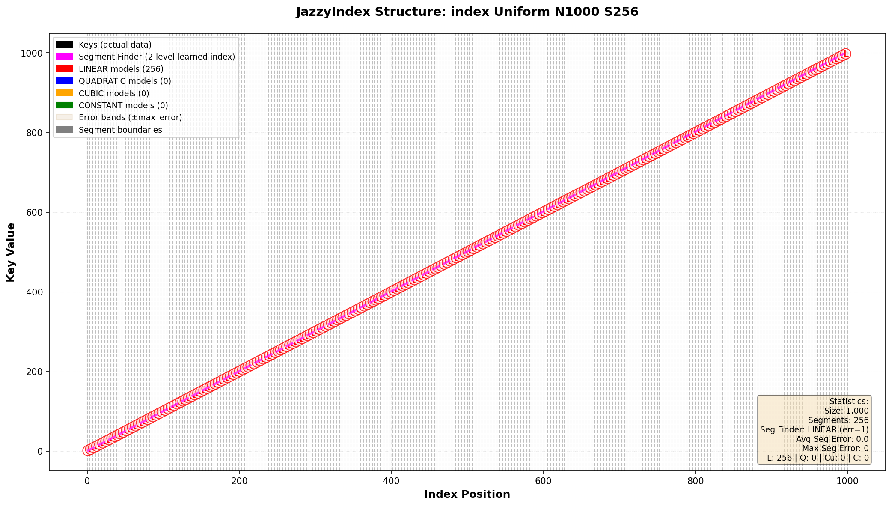
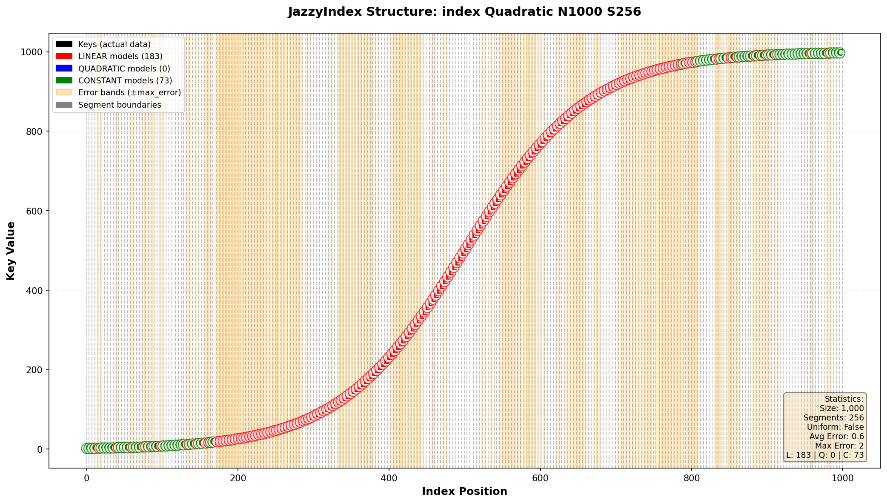
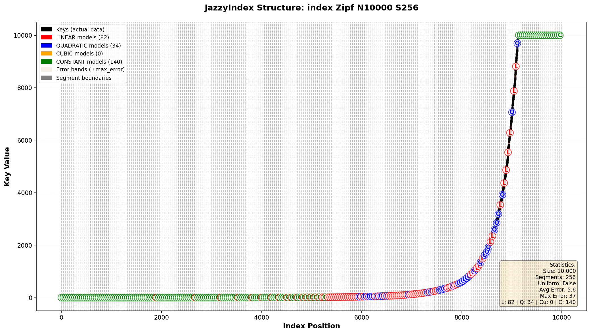
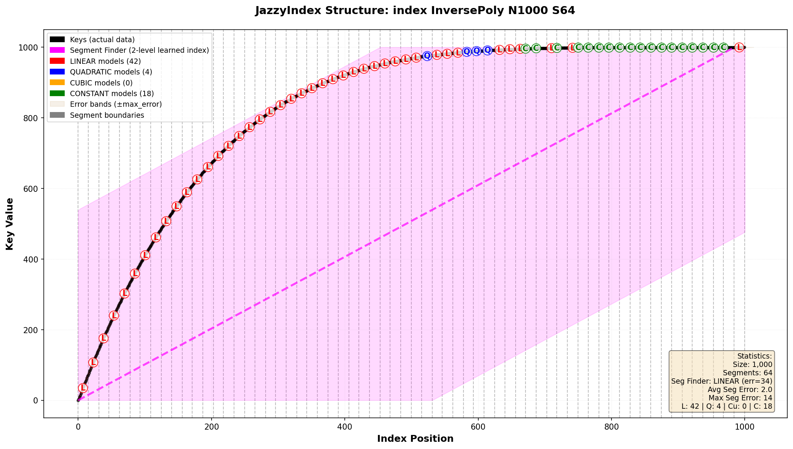

# JazzyIndex Structure Visualizations

This document explains how to interpret the index structure visualizations generated by JazzyIndex.

## Table of Contents
- [Overview](#overview)
- [Understanding the Plots](#understanding-the-plots)
- [Example Visualizations](#example-visualizations)
- [Generating Your Own](#generating-your-own)

## Overview

JazzyIndex generates visualizations that show exactly how it partitions data into segments and what prediction models (constant, linear, or quadratic) it selects for each segment. These visualizations are invaluable for understanding:

- How well the learned models fit your data distribution
- Whether quadratic models are being selected for curved regions
- What the maximum prediction errors are per segment
- How segment boundaries align with your data

## Understanding the Plots

### Visual Elements

Each visualization shows:


*Example: Uniform distribution with perfect linear fit*

#### Keys (Black Dots)
- The actual data points (key-value pairs) in your dataset
- X-axis shows the **index position** (0 to N-1)
- Y-axis shows the **key value** at that position

#### Segment Boundaries (Gray Vertical Lines)
- Divide the data into equal-sized segments based on **quantiles**, not values
- Each segment contains approximately N/S elements (where S = segment count)
- Dashed vertical lines mark where one segment ends and the next begins

#### Model Lines

Three types of prediction models are displayed:

**🔴 LINEAR Models (Red)**
- Formula: `predicted_index = m × value + b`
- Cost: 1 FMA (fused multiply-add) instruction
- Used when data within a segment is approximately linear

**🔵 QUADRATIC Models (Blue)**
- Formula: `predicted_index = a × value² + b × value + c`
- Cost: 3 FMA instructions
- Used when data has curvature and quadratic fit reduces error by ≥30%
- Fitted using Cramer's rule on a normalized [0,1] input range

**🟢 CONSTANT Models (Green)**
- Formula: `predicted_index = c`
- Cost: 0 computation
- Used when all values in a segment are identical

#### Error Bounds (Tan Bands)

The tan shaded regions surrounding each model line represent the **prediction error tolerance zones**. Here's what they mean:

- **What they show:** The horizontal width of the band extends ±max_error from the model's prediction line throughout the entire segment
- **What max_error means:** The worst-case difference between where the model predicts an index should be versus where it actually is within that segment
- **Why they matter:** During a query, JazzyIndex uses this error bound to determine the search radius. If max_error is 5, the algorithm knows to search within ±5 positions of the predicted index
- **Performance impact:** Narrower bands = smaller max_error = tighter search radius = faster queries. Wide bands mean the model is a poor fit and more searching is needed
- **Visual interpretation:** The band creates an "envelope" or "tunnel" around each model line. If you see black dots touching or exceeding the band edges, those are the worst-case prediction errors that define the band width

### Statistics Box

In the bottom-right corner, you'll find:
- **Size**: Number of elements in the dataset
- **Segments**: Number of segments the index uses
- **Uniform**: Whether the index detected uniform spacing (enables O(1) segment lookup)
- **Avg Error**: Average maximum error across all segments
- **Max Error**: Worst-case maximum error among all segments
- **L/Q/C Counts**: Number of LINEAR / QUADRATIC / CONSTANT models selected

## Example Visualizations

### 1. Uniform Distribution


**Characteristics:**
- Perfectly linear data
- All segments use LINEAR models (red)
- Very tight error bounds (avg error ~5)
- Ideal case for learned indexes

**Key Insight:** Uniform data is trivial for JazzyIndex - every segment gets a perfect linear fit.

---

### 2. Quadratic (S-Curve) Distribution



**Characteristics:**
- S-shaped curve using `tanh` function
- Mix of LINEAR and QUADRATIC models
- Quadratic models (blue) fit the curved regions perfectly
- Error bounds remain tight throughout

**Key Insight:** This demonstrates adaptive model selection - JazzyIndex uses quadratic models only where the curvature justifies the extra computational cost.

---

### 3. Extreme Polynomial Distribution


**Characteristics:**
- Data follows y = x⁵ (explosive curvature at the end)
- **5 QUADRATIC models** (blue) for the curved right side
- 1 LINEAR model (red) for the flat left side
- 2 CONSTANT models (green) at the very beginning
- Low segment count (S=8) shows model selection clearly

**Key Insight:** With only 8 segments, you can clearly see how JazzyIndex adapts its model complexity to match the data's local behavior. The quadratic models handle the steep curve at the end, while simpler models suffice elsewhere.

---

### 4. Zipf Distribution



**Characteristics:**
- Heavy-tailed power-law distribution (common in real-world data)
- Rapid growth at the beginning, then long tail
- Mix of QUADRATIC and LINEAR models
- Larger dataset (N=10,000) with more segments (S=256)

**Key Insight:** Zipf distributions are challenging but common (word frequencies, web traffic, etc.). JazzyIndex adapts by using quadratic models where the rate of change is high.

---

### 5. Inverse Polynomial Distribution



**Characteristics:**
- Data follows y = 1 - (1-x)⁵ (steep start, gentle end)
- Quadratic models at the beginning for the steep curve
- Linear models for the gentler middle/end sections
- Medium segment count (S=64) balances granularity and overhead

**Key Insight:** The inverse curvature of ExtremePoly - demonstrates that JazzyIndex handles both "accelerating" and "decelerating" curves equally well.

---

## Segment Count Effects

The number of segments you choose dramatically affects the index structure:

### Few Segments (S=8)
- **Pros:** Lower memory footprint, faster segment lookup
- **Cons:** Larger error bounds per segment, more reliance on quadratic models for complex data
- **Best for:** Small datasets (< 1K elements), memory-constrained environments

### Medium Segments (S=64-256)
- **Pros:** Good balance of accuracy and overhead
- **Cons:** None - this is the sweet spot for most use cases
- **Best for:** General-purpose use (1K-1M elements)

### Many Segments (S=512-2048)
- **Pros:** Very tight error bounds, minimal search overhead
- **Cons:** Higher memory cost, slower segment lookup
- **Best for:** Large datasets (> 1M elements), latency-critical applications

## Generating Your Own

To generate index structure visualizations for your data:

```bash
cmake --build build --target visualize_index
```

This will:
1. Run benchmarks with index structure dumping enabled
2. Generate visualization plots for all distributions and segment counts
3. Save plots to [docs/images/index_data/](images/index_data/)

### All Available Visualizations

The `visualize_index` target generates **270+ plots** in **[docs/images/index_data/](images/index_data/)** covering:
- **9 distributions**: Uniform, Exponential, Clustered, Lognormal, Zipf, Mixed, Quadratic, ExtremePoly, InversePoly
- **10 segment counts**: 1, 2, 4, 8, 16, 32, 64, 128, 256, 512
- **Multiple sizes**: 100, 1000, 10000 elements

**Browse all plots:** After running `visualize_index`, explore [docs/images/index_data/](images/index_data/) to see every combination.

The naming convention is: `index_{Distribution}_N{Size}_S{Segments}.png`

Examples:
- `index_Uniform_N10000_S256.png` - Uniform distribution, 10K elements, 256 segments
- `index_Zipf_N1000_S64.png` - Zipf distribution, 1K elements, 64 segments
- `index_ExtremePoly_N1000_S8.png` - Extreme polynomial, 1K elements, 8 segments

---

## Key Takeaways

1. **Error bounds matter:** The tan bands show prediction accuracy - narrower is better
2. **Quadratic models are selective:** JazzyIndex only uses them when they provide ≥30% error reduction
3. **Segment count is a dial:** Turn it up for accuracy, down for memory/speed
4. **Quantile partitioning:** Segments contain equal element counts, not equal value ranges
5. **Adaptive is powerful:** The same index code produces optimal strategies for radically different distributions

---

**See also:**
- [BENCHMARKS.md](BENCHMARKS.md) - Performance analysis across distributions
- [MODEL_SELECTION.md](MODEL_SELECTION.md) - Technical deep-dive into model fitting algorithms
- [README.md](../README.md) - Main documentation and usage guide
